### Практические навыки работы с ZFS ###

1. Определение алгоритма с наилучшим сжатием

Список всех дисков, которые ксть на виртуальной машине:

```
lsblk
```

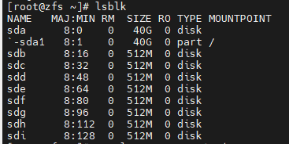

Создание пулов в режиме RAID 1:

zpool create otus1 mirror /dev/sdb /dev/sdc
zpool create otus2 mirror /dev/sdd /dev/sde
zpool create otus3 mirror /dev/sdf /dev/sdg
zpool create otus4 mirror /dev/sdh /dev/sdi


Созданные пулы:

```
zpool list
```

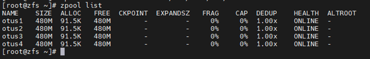


```
zpool status
```

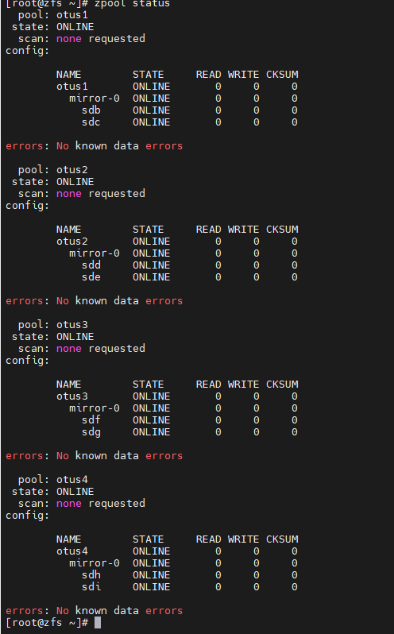

Добавление разных алгоритмов сжатия в каждую файловую систему:
- Алгоритм lzjb: zfs set compression=lzjb otus1
- Алгоритм lz4: zfs set compression=lz4 otus2
- Алгоритм gzip: zfs set compression=gzip-9 otus3
- Алгоритм zle: zfs set compression=zle otus4

Методы сжатия файловых систем:
```
zfs get all | grep compression
```

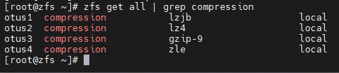

Скачивание файлов во все пулы:

```
for i in {1..4}; do wget -P /otus$i https://gutenberg.org/cache/epub/2600/pg2600.converter.log; done
```
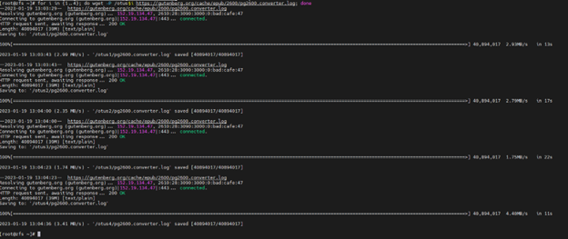

Проверим, что файл был скачан во все пулы:
```
ls -l /otus*
```
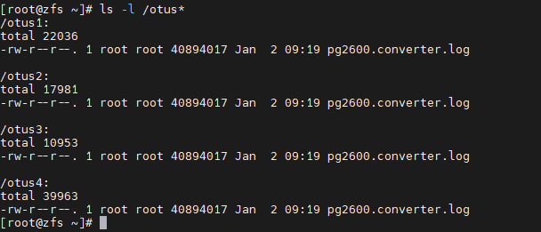

Проверим, сколько места занимает один и тот же файл в разных пулах и
проверим степень сжатия файлов:

```
zfs list
```

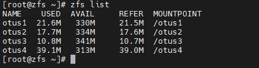

```
zfs get all | grep compressratio | grep -v ref
```
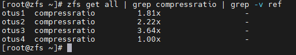

#### Вывод

***Алгоритм gzip-9 самый эффективный по сжатию.***

2. Определение настроек пула

Скачиваем архив в домашний каталог:

```
wget -O archive.tar.gz --no-check-certificate 'https://drive.google.com/u/0/uc?id=1KRBNW33QWqbvbVHa3hLJivOAt60yukkg&e
xport=download'
```
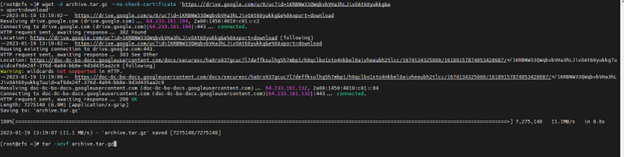

Разархивируем его:
```
tar -xzvf archive.tar.gz
```
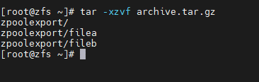

Проверка, возможно ли импортировать данный каталог в пул:
```
zpool import -d zpoolexport/
```

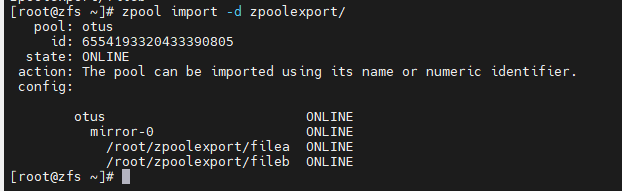

Импорт пула otus в ОС:

```
zpool import -d zpoolexport/ otus
```

Данный вывод показывает нам имя пула, тип raid и его состав. Сделаем импорт данного пула к нам в ОС:
```
zpool status
```
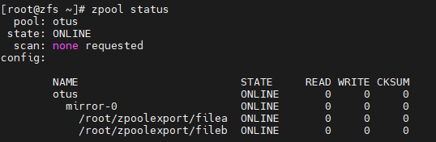


Уточнение параметров пула:
```
zfs get available otus;
zfs get recordsize otus;
zfs get compression otus;
zfs get checksum otus
```

3. Работа со снапшотом, поиск сообщения от преподавателя

Скачивание файла, указанного в задании:
```
wget -O otus_task2.file --no-check-certificate 'https://drive.google.com/u/0/uc?id=1gH8gCL9y7Nd5Ti3IRmplZPF1XjzxeRAG&e
xport=download'
```
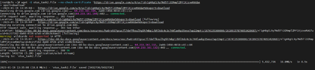

Восстановим файловую систему из снапшота: 
```
zfs receive otus/test@today < otus_task2.file
```

Далее, ищем в каталоге /otus/test файл с именем “secret_message”:

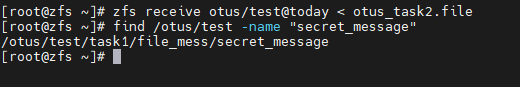

```
find /otus/test -name "secret_message"
```

```
cat /otus/test/task1/file_mess/secret_message
```
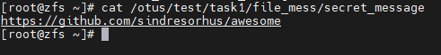

```
https://github.com/sindresorhus/awesome
```

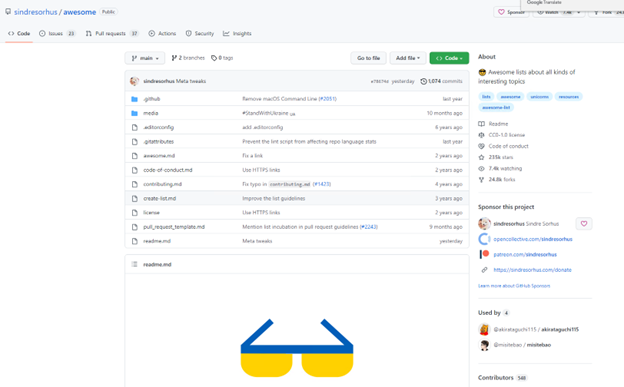


